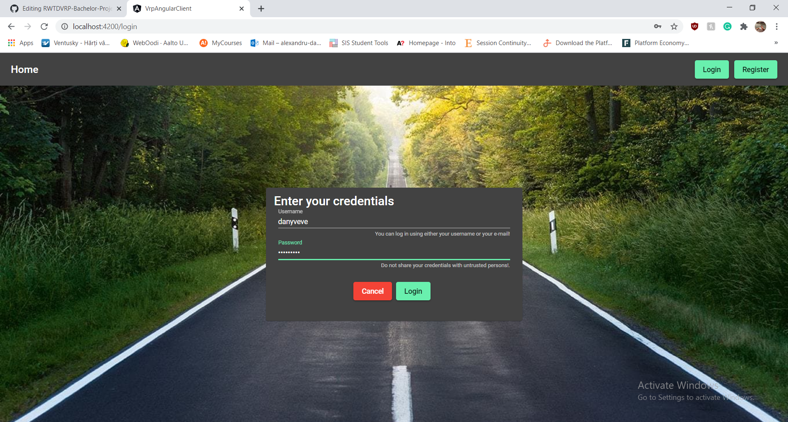

# RWTDVRP

## Project overview
The ideea of this project was to create a Real World Time Dependent Vehicle Routing Problem solver using a Self Adaptive genetic algorithm and uses the power of the Google Directions API to make real world predictions of the travel costs of given routes, based on the departure time. The solution is actually split into 2 applications:
* An API written in Java (using Spring Boot) that receives a RWTDVRP instance in JSON format and solves it. It makes use of the Google Directions API and a custom thread safe cache, since the execution of the API is parallelized in order to support multiple solvers running concurently. The solution can be retrieved on demand, and that's the point when the solver stops and retrieves the best solution found until the stopping time. If the solution is not requested and the solver does not improve over a predefined number of iterations, the solver will stop and will store the best solution found, untill it will be requested.
* A Wrapper Application with a client-server architecture that allows each user to create custom RWTDVRP instances and submit them to be solved by the before mentioned API.
  - The server is written in Java, using Spring Boot and Spring Security, and uses a MySQL DB for storing users, VRP instances and solutions among other important objects;
  - The client is an Angular application.

## Features of the Wrapper Application:
* Login, logout, register;
* Edit profile;
* Add/Delete/Update/List/Filter/Sort/See details (of) driver(s);
* Create a custom RWTDVRP instance;
* Stop the solver for a custom RWTDVRP instance;
* See the details & solution of an already solved custom RWTDVRP instance;
* List/Filter/Sort RWTDVRP instances.

## How to start the project:
**Backend of the API:**
* Make sure that you have a Google Cloud project with Directions API enabled and a generated API key;
* Make sure that the "rwtdvrp.google-maps-api-key" key from the application.properties file is set according to your own API key;
* Run the app.

**Backend of the Wrapper Application:**
* Make sure that you have installed a mysql server and created an empty "vrp" database (tables will be generated automatically);
* Modify the "...initializeData.sql" migration file from the resources folder in order to customize your initial data that will be inserted in the DB tables;
* Run the app.

**Frontend of the Wrapper Application:**
* Make sure that you have a Google Cloud project with Geocoding API, Places API and Maps JavaScript API enabled and a generated API key;
* Set the "apiKey" key of the AgmCoreModule module to match your own API key;
* Install Node.js;
* Install Angular CLI;
* Run "npm install" followed by "npm audit fix" in the vrp-angular-client folder from the frontend module;
* Run "npm start" on the same vrp-angular-client folder.

## Screenshots from the application

